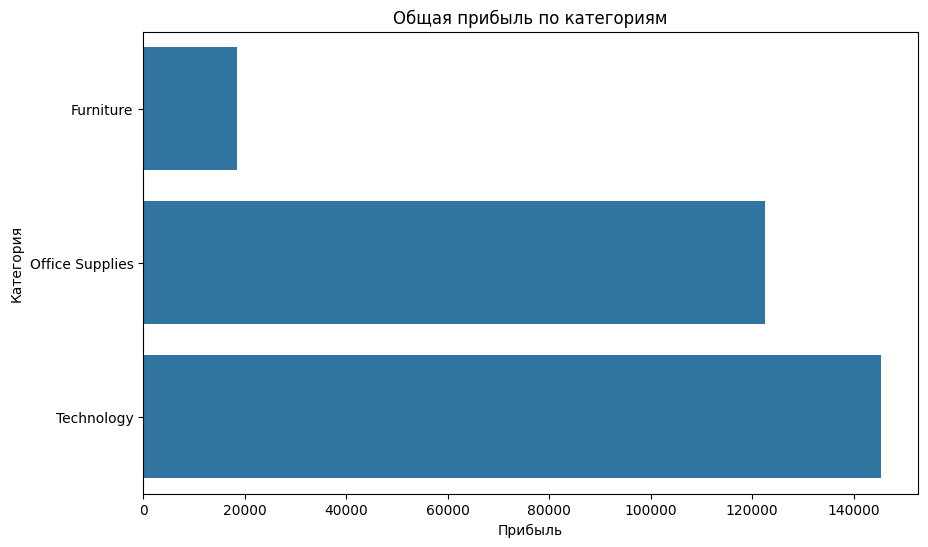

# 📊 Пет-проект: Анализ данных супермаркета
  
## 📌 Цель проекта
Проанализировать данные из датасета Tableau Superstore.xlsx, чтобы:

- Понять структуру продаж
- Определить категории и регионы с наибольшей и наименьшей прибылью
- Выявить влияние скидок на прибыль
- Сформулировать гипотезы для улучшения бизнес-процессов

---
  
## 📈 Продажи и прибыль по категориям
```markdown
   

📈 Продажи по категориям
0
📊 Что показывают графики:
Общая прибыль по категориям:

Technology — самая прибыльная категория (~145,000)
Канцтовары — вторая по прибыльности категория (~120 000)
Furniture — значительно уступает другим категориям (~20,000)
Общие продажи по категориям:
Technology — лидирует по продажам (~850,000)
Офисная техника — вторая по объему продаж (~720 000)
Мебель — также имеет высокий объем продаж (~750 000), но при этом показывает низкую прибыль
🧠 Выводы:
1. Разница между продажами и прибылью
Технологии: самая прибыльная категория. Высокие продажи + высокая маржа → стабильный источник дохода.
Канцтовары: средняя прибыльность. Продажи чуть ниже, чем у технологий, но всё ещё значительные.
Мебель: низкая прибыльность. Большие продажи, но низкая маржа → потенциальная проблема с ценовой политикой или издержками.
2. Причины низкой прибыли в Furniture

Возможно, высокие затраты на производство или доставку мебели.
Могут быть большие скидки для привлечения клиентов.
Может потребоваться пересмотр ценовой политики для этой категории.
3. Технологии как ключевая категория
Technology демонстрирует высокие продажи и прибыль.
Это может быть связано с высокой рентабельностью технологических товаров (например, электроники, устройств).
Возможно, стоит инвестировать больше ресурсов в эту категорию.
4. Офисные принадлежности как баланс между продажами и прибылью Офисные принадлежности имеют средний уровень прибыли. Это может быть связано с более конкурентным рынком или низкой рентабельностью некоторых товаров.
💡 Гипотезы для дальнейшего анализа:
1. Как увеличить прибыль в Furniture?

Гипотеза 1: Повысить цены на некоторые товары с низкой рентабельностью.
Гипотеза 2 : Оптимизировать логистику и хранение.
Гипотеза 3: сосредоточиться на более дорогих и прибыльных подкатегориях мебели.
2. Можно ли увеличить продажи Office Supplies?
Гипотеза 1: провести A/B-тестирование ценовых стратегий.
Гипотеза 2 : Улучшить маркетинговые кампании для этой категории.
Гипотеза 3: Разработать новые продукты или услуги, связанные с канцелярскими принадлежностями.
📉 Прибыль по регионам
0
📊 Что показывает график:
Продажи по регионам:

West — лидирует по объёму продаж (~720 000).
East — второй по объему продаж (~680,000).
Central — третье место (~500,000).
South — имеет наименьшие продажи (~400,000).
Прибыль по регионам:
West — самая прибыльная зона (~105,000).
East — вторая по прибыльности (~90,000).
Central — третья по прибыльности (~40,000).
South — наименее прибыльный регион (~45,000).
🧠 Выводы:
Запад:
1. Регионы с высокими продажами и прибылью Лидирует как по продажам, так и по прибыли. Это может быть связано с высокой плотностью населения, большим спросом или эффективной маркетинговой стратегией в этом регионе.
Восток: второй по объему продаж и прибыли. Возможно, этот регион также имеет значительную клиентскую базу и стабильный спрос.
Юг:
2. Регионы с низкими показателями Низкие продажи и прибыль. Может быть связано с меньшей концентрацией покупателей, низким спросом или неэффективной ценовой политикой.
Центральный: продажи выше, чем на Юге, но прибыль ниже, чем на Востоке и Западе. Возможно, высокие издержки или низкая рентабельность товаров в этом регионе.
3. Связь между продажами и прибылью
В целом, регион West демонстрирует лучший баланс между объемом продаж и прибылью. Регион East также показывает хорошие результаты, но его прибыль немного ниже, чем у West. Регионы South и Central имеют низкую рентабельность, что требует внимания.

💡 Гипотезы для дальнейшего анализа:
1. Как увеличить прибыль в Central и South?

Гипотеза 1: Оптимизация ценовой политики (увеличение маржи).
Гипотеза 2 : Улучшение логистики и снижение издержек.
Гипотеза 3 : Фокус на наиболее прибыльных категориях товаров.
2. Можно ли улучшить эффективность в East?
Гипотеза 1: провести A/B-тестирование ценовых стратегий.
Гипотеза 2 : Увеличить инвестиции в маркетинг для привлечения новых клиентов.
Гипотеза 3: Анализировать успешные западные практики и применять их на Востоке.
📆 Продажи по месяцам
0
📊 Что показывает график:
Продажи по месяцам:
График отображает динамику продаж с 2013 по 2017 год.
Продажи имеют сезонные колебания:

Периоды роста (например, конец года).
Периоды спада (например, начало года).
Общие тенденции:

В целом, продажи растут со временем.
Есть высокая волатильность — большие пики и провалы.
Пиковые точки:

Высокие продажи наблюдаются в конце каждого года (например, в декабре 2016 и 2017 годов).
Низкие продажи чаще всего происходят в начале года (январь–февраль).
🧠 Выводы из графика:
1. Сезонность продаж

Рост продаж в конце года: это может быть связано с праздничным сезоном (например, Рождество, Новый год).
Снижение продаж в начале года: возможно, клиенты закупают товары заранее к праздникам или ожидают появления новых товаров после зимних каникул.
2. Общая тенденция роста

Продажи стабильно росли с 2013 по 2017 год.
Это указывает на рост бизнеса и увеличение клиентской базы.
3. Волатильность
Большая волатильность может быть связана с:

Сезонными акциями или промоакциями.
Изменениями в логистике или производственных процессах.
Короткими сроками действия скидок.
💸 Скидка vs Прибыль
0
📊 Что показывает график:
Скидка (%) на оси x: указана доля скидки, которую получают клиенты.
Прибыль по оси Y: показывает прибыль от заказов с данной скидкой.
Цвета : Разные категории товаров (Office Supplies, Furniture, Technology).

Основные наблюдения:

Точки выше нулевой линии : Значит, прибыль положительная.
Точки ниже нулевой линии : Значит, прибыль отрицательная (убытки).
Красная пунктирная линия: нулевая прибыль — граница между прибылью и убытками.
🧠 Выводы из графика:
1. Корреляция между скидкой и прибылью

Общая тенденция: с увеличением скидки (выше 0,4–0,5) прибыль снижается.
Убытки: при больших скидках (более 0,6) многие точки оказываются ниже нулевой линии, что указывает на убытки.
2. При какой скидке начинаются убытки?
Около 0,6–0,7: большинство точек для всех категорий пересекают нулевую линию в этом диапазоне. Это означает, что при скидках выше 60–70% компания начинает терять деньги.

3. Различия между категориями:

Технология: лучшая стабильность прибыли даже при высоких скидках. Меньше точек ниже нулевой линии.
Мебель: наиболее чувствительна к скидкам. Многие точки находятся ниже нулевой линии уже при средних скидках (0,4–0,5).
Канцелярские товары: похожи на мебель, но менее чувствительны к скидкам.
💡 Гипотезы для проверки:
1. Как влияют скидки на прибыль?

Гипотеза 1 : Чем выше скидка, тем больше вероятность убытков.
Гипотеза 2: существует оптимальный уровень скидок, после которого прибыль резко падает.
Гипотеза 3 : Категории товаров реагируют по-разному на скидки.
2. Почему Technology лучше других категорий?
Гипотеза 1: высокая маржинальность технологических товаров позволяет сохранять прибыль даже при больших скидках.
Гипотеза 2: Другие категории имеют более низкую маржинальность, поэтому скидки быстро приводят к убыткам.
3. Можно ли найти оптимальную скидку?
Гипотеза 1: существует оптимальный диапазон скидок (например, 0–0,3), при котором прибыль максимальна.
Гипотеза 2 : Для каждой категории существует свой оптимальный уровень скидок.
4. Что происходит при очень высоких скидках?
Гипотеза 1: очень высокие скидки (более 0,7) всегда приводят к убыткам.
Гипотеза 2: Возможно, есть исключения — некоторые товары могут быть выгодными даже при больших скидках.
🏆 Топ-10 клиентов по количеству заказов
0
📊 Что показывает график:
1. Ключевые клиенты
Эмили Фан: сделала 17 заказов — это наибольшее количество среди всех клиентов . Возможно, это корпоративный клиент или часто совершающий покупки . Другие клиенты (Рик Бенсли, Ноэль Стаавос, Джоэл Итон и др.): сделали 12–13 заказов.
2. Распределение заказов
Одинаковое количество заказов может указывать на стабильность спроса среди этих клиентов.
3. Возможные причины активности клиентов
Эмили Фан: может быть корпоративным клиентом с регулярными заказами. Возможно, она покупает большие партии товаров или часто делает небольшие заказы. Другие клиенты: могут быть частными лицами или малыми предприятиями. Их активность может быть связана с регулярными потребностями в товарах.

💡 Гипотезы для дальнейшего анализа:
1. Как удержать ключевых клиентов?

Гипотеза 1 : Предложить персонализированные предложения для ключевых клиентов.
Гипотеза 2: Создать программу лояльности для часто совершающих покупки клиентов.
Гипотеза 3: Проанализировать потребности этих клиентов и предложить им специальные пакеты услуг.
2. Можно ли увеличить количество заказов у других клиентов?
Гипотеза 1: провести A/B-тестирование различных маркетинговых стратегий для активных клиентов.
Гипотеза 2: Оптимизировать логистику и доставку для улучшения клиентского опыта.
Гипотеза 3: Предложить специальные акции для клиентов, которые делают меньше заказов, чем Эмили Фан.
🔍 Ключевые выводы
Категория «Технологии» — самая прибыльная (около 145 000 долларов).
Мебель имеет высокие продажи, но низкую прибыль (около 20 000 долларов) → маржинальность слишком низкая.
West — самый прибыльный регион.
При скидках свыше 60–70% компания начинает терять деньги.
Эмили Фан лидирует по количеству заказов (17), что может указывать на корпоративную активность.
💡 Гипотезы
Номер	Гипотеза
1	При скидке более 50% начинаются убытки
2	Убытки в Furniture связаны с логистикой и хранением
3	Регион South можно сделать более прибыльным через маркетинг
4	Таблицы и переплётные системы требуют пересмотра ценовой политики
5	Можно прогнозировать рост продаж к концу года и готовиться к нему заранее
